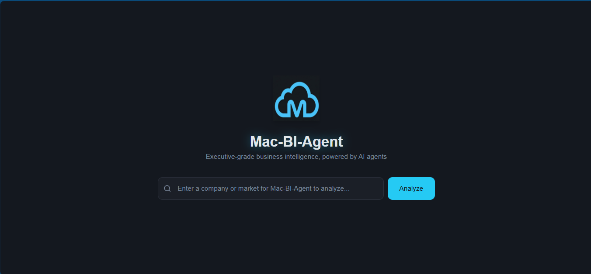
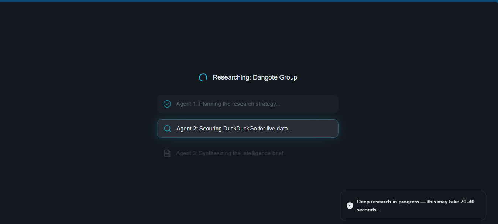
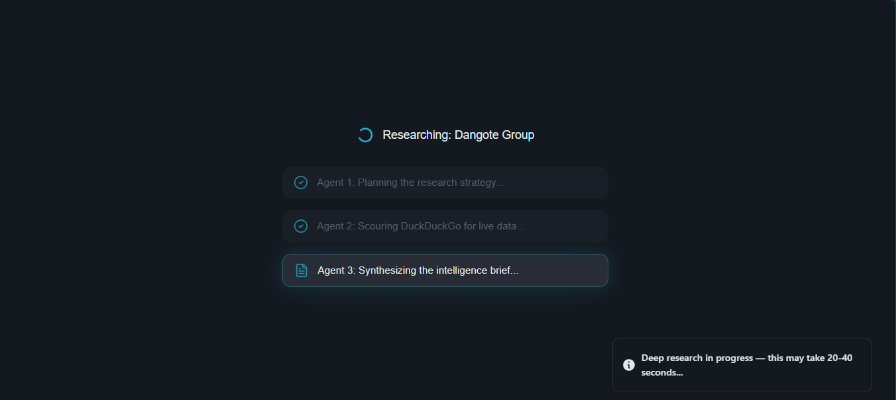
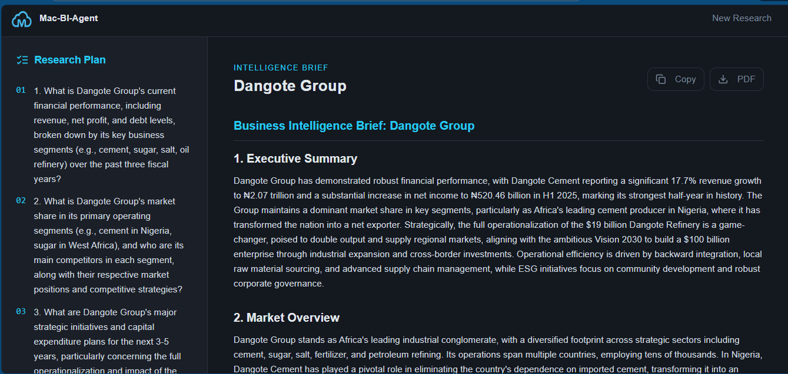
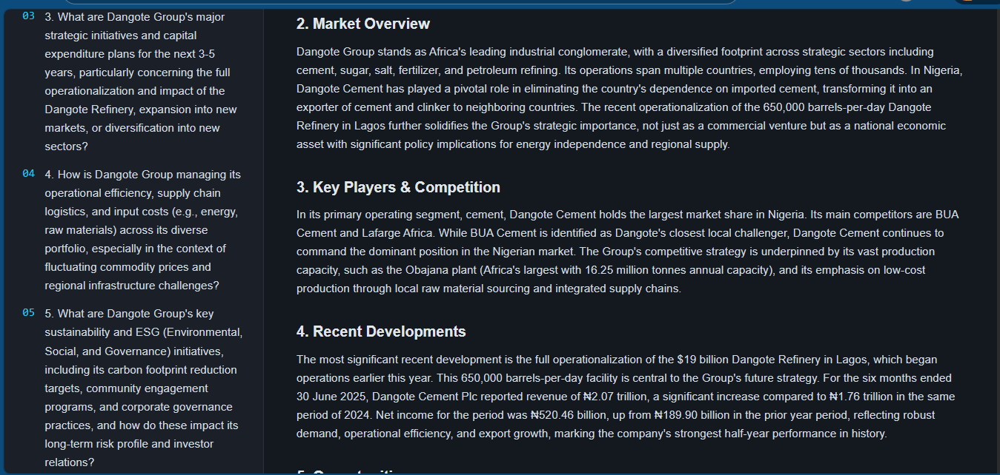
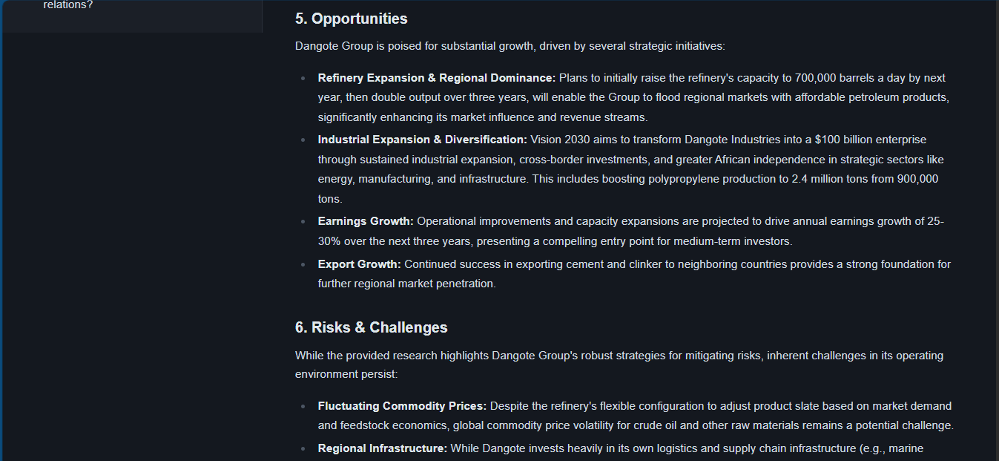
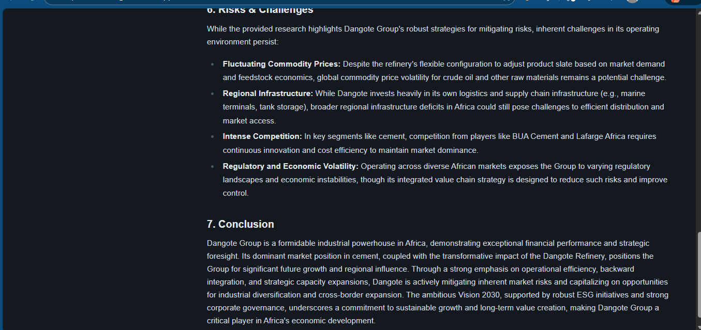

# Mac-BI-Agent — Multi-Agent Business Intelligence System

A full-stack multi-agent AI system that generates comprehensive business intelligence briefs on any company or market. Three specialized AI agents collaborate in sequence — Planner, Researcher, and Writer — orchestrated by LangGraph and powered by Google Gemini.

**Live Demo:** [mac-bi-agent.vercel.app](https://mac-bi-agent.vercel.app)
**Backend API:** [business-intel-agent.onrender.com](https://business-intel-agent.onrender.com/docs)

---

## Screenshots

### Welcome Screen


### Agent 1 — Planner Running


### Agent 2 — Researcher Scouring the Web


### Intelligence Brief — Executive Summary & Market Overview


### Intelligence Brief — Key Players & Recent Developments


### Intelligence Brief — Opportunities


### Intelligence Brief — Conclusion


---

## How It Works

Three AI agents collaborate in a LangGraph pipeline to produce a full business intelligence brief:

```
User inputs topic
      ↓
Planner Agent — creates 5 targeted research questions
      ↓
Research Agent — searches the web for each question via DuckDuckGo
      ↓
Writer Agent — synthesizes findings into a 7-section brief
      ↓
Structured intelligence brief returned to frontend
```

**Example input:** "Dangote Group"

**Output:** A full brief covering Executive Summary, Market Overview, Key Players & Competition, Recent Developments, Opportunities, Risks & Challenges, and Conclusion — all sourced from live web data.

---

## Features

- Three-agent collaboration orchestrated by LangGraph
- Live web search via DuckDuckGo for real, current data
- 7-section structured business intelligence brief
- Research Plan sidebar showing the Planner agent's questions
- Agent progress animation showing each agent working in real time
- Copy and PDF export buttons
- Suggested topic chips for quick research
- Fully responsive — works on mobile and desktop
- Handles Render free tier cold starts gracefully

---

## Tech Stack

| Layer | Technology |
|-------|------------|
| Frontend | React, TypeScript, Tailwind CSS, Vite |
| Backend | FastAPI, Python 3.11 |
| Agent Orchestration | LangGraph |
| LLM | Google Gemini 2.5 Flash |
| Web Search | DuckDuckGo Search |
| Frontend Hosting | Vercel |
| Backend Hosting | Render |

---

## Agent Architecture

```python
# LangGraph pipeline
workflow = StateGraph(AgentState)
workflow.add_node("planner", planner_agent)    # Creates research questions
workflow.add_node("researcher", research_agent) # Searches web for answers
workflow.add_node("writer", writer_agent)       # Writes the brief
workflow.set_entry_point("planner")
workflow.add_edge("planner", "researcher")
workflow.add_edge("researcher", "writer")
workflow.add_edge("writer", END)
```

**Planner Agent** — Given a topic, creates 5 specific, targeted research questions covering financials, market position, competition, recent developments, and opportunities.

**Research Agent** — Takes each question and runs a live DuckDuckGo search, compiling real data from the web into a structured research document.

**Writer Agent** — Takes the compiled research and produces a professional 7-section business intelligence brief in markdown format.

---

## API Endpoints

| Method | Endpoint | Description |
|--------|----------|-------------|
| `GET` | `/` | Health check |
| `POST` | `/research` | Generate a business intelligence brief |

### POST /research

**Request:**
```json
{
  "topic": "Nigerian fintech market"
}
```

**Response:**
```json
{
  "topic": "Nigerian fintech market",
  "plan": "1. What is the current market size...\n2. Who are the top players...",
  "brief": "## Business Intelligence Brief: Nigerian Fintech Market\n\n### 1. Executive Summary\n..."
}
```

---

## Running Locally

```bash
git clone https://github.com/merezki-11/business-intel-agent.git
cd business-intel-agent
pip install -r requirements.txt
```

Create a `.env` file:
```
GOOGLE_API_KEY=your_gemini_api_key_here
```

Start the server:
```bash
uvicorn main:app --reload
```

API runs at `http://127.0.0.1:8000`
Interactive docs at `http://127.0.0.1:8000/docs`

---

## Project Structure

```
business-intel-agent/
│
├── main.py              # FastAPI app + LangGraph multi-agent pipeline
├── requirements.txt     # Python dependencies
├── .python-version      # Pins Python 3.11 for Render
├── .gitignore
├── images/              # App screenshots
└── README.md
```

---

## Example Topics to Try

- Nigerian fintech market
- Dangote Group
- MTN Nigeria
- African e-commerce landscape
- Lagos real estate market
- Flutterwave
- Access Bank Nigeria

---

## Related Projects

- [gemini-cli-chatbot](https://github.com/merezki-11/gemini-cli-chatbot) — Phase 1: Gemini CLI chatbot
- [gemini-web-chatbot](https://github.com/merezki-11/gemini-web-chatbot) — Phase 1: Full-stack AI tutor web app
- [rag-document-qa](https://github.com/merezki-11/rag-document-qa) — Phase 2: RAG Document Q&A system

---

## Author

**Macnelson Chibuike**
- GitHub: [@merezki-11](https://github.com/merezki-11)
- LinkedIn: [Macnelson Chibuike](https://www.linkedin.com/in/macnelson-chibuike)

---

## License

This project is open source and available under the [MIT License](LICENSE).
